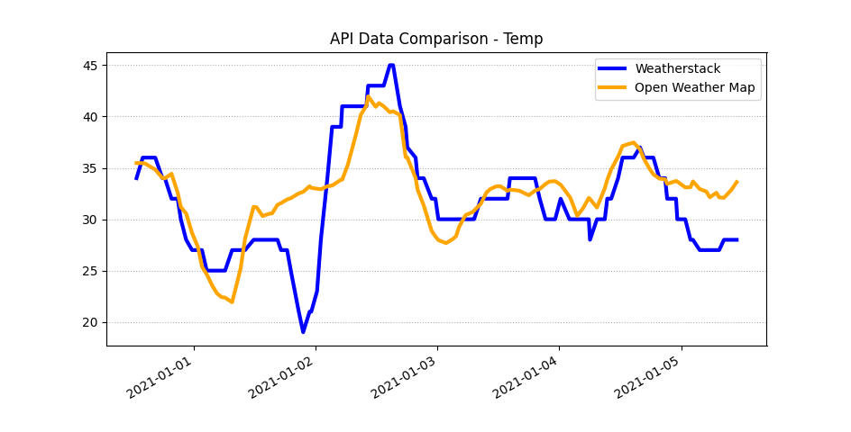

# Weather API Comparison

Compares 8 different parameters between Open Weather Map API and Weatherstack API
for one hundred twenty different timestamps over the past 5 days.

        ******************************** 
        ******  Weather API Test  ****** 
        ******************************** 

        [1] Get Data from APIs
        [2] Print Weather Data
        [3] Save Weather Data
        [t] Display Temp Chart
        [p] Display Pressure Chart       
        [d] Display Dew Point Chart      
        [h] Display Humidity Chart       
        [c] Display Cloud Chart
        [v] Display Visibility Chart     
        [ws] Display Wind Speed Chart    
        [wd] Display Wind Direction Chart
        [q] Quit

        Selection?
        

